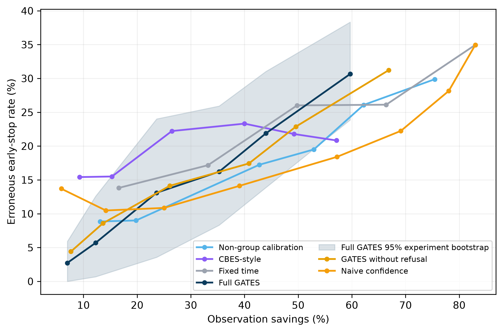
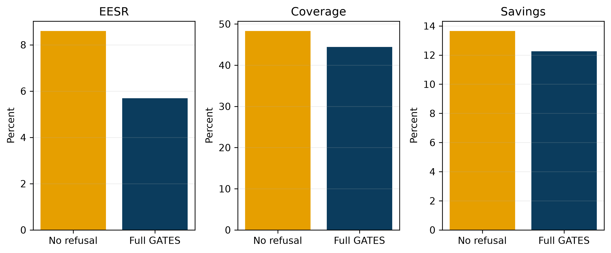
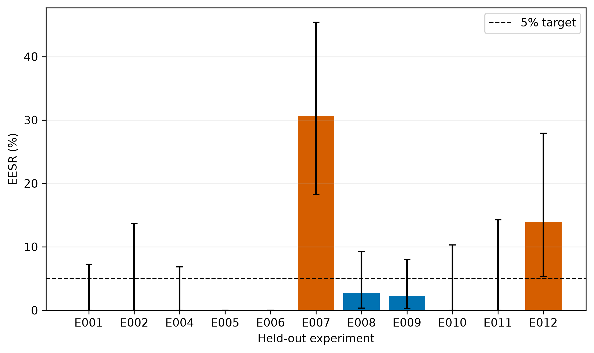

# Abstract

Longitudinal biological experiments are commonly observed on a fixed schedule even when their
endpoint becomes predictable earlier. GATES asks a decision question rather than only a prediction
question: **does the available evidence justify stopping measurement for this trajectory?** It
combines experiment-disjoint model fitting, independent-group calibration, adaptive
STOP/CONTINUE decisions, and feature-distance refusal. On 988 medaka retinal organoids from 11
independent experiments, Full GATES made 439 early decisions with 25 errors: 5.69% observed
held-out erroneous-early-stop rate (EESR; unit-level exact 95% CI 3.72%-8.29%), 44.43% coverage,
and 12.26% retrospectively estimated observation savings. Without refusal, EESR increased to
8.60% while savings increased to 13.65%. A tested CBES-style binary adaptation reached 15.51%
EESR. These results are empirical, not a 5% guarantee: uncertainty across experiments is wide,
E007 reached 30.61% EESR, Lens transfer failed, and irregular sampling degraded performance.
GATES is an auditable retrospective framework, not a deployment-ready controller. Its next test is
prospective evaluation in independent laboratories and direct organ-on-chip systems.

# 1. Problem and motivation

Most experimental AI extracts information after measurements have already been collected. GATES
asks whether collecting the next observation is still justified. If a valid early decision were
available, later acquisition, storage, and analysis could be avoided for selected units. A wrong
early call can instead corrupt an experiment by terminating observation before the true endpoint is
known. The policy must therefore trade premature-decision risk against observation cost.

Ordinary endpoint prediction does not solve this problem. A classifier can be accurate on average
yet fail severely in one biological experiment. A stopping policy must decide when the current
prefix is sufficient, account for experiment-to-experiment heterogeneity, and retain the option to
continue or refuse. The core question is: **do we know enough to stop measuring?**

# 2. Contribution and positioning

GATES converts longitudinal biological prediction into an experiment-disjoint selective stopping
problem, combining independent-group calibration with refusal and evaluating the resulting policy
through explicit risk-versus-observation-cost tradeoffs.

The project does not claim to invent early time-series classification, selective prediction,
abstention, calibration, OOD detection, or experimental early stopping. Its distinct contribution
is the combination of:

1. binary longitudinal biological endpoint prediction;
2. complete experiment-level separation;
3. calibration on independent biological experiments;
4. adaptive STOP/CONTINUE decisions;
5. explicit ABSTAIN behavior;
6. risk-savings and risk-coverage evaluation;
7. visible negative results and experiment-level failures; and
8. reproducible decision-level evidence.

The source orgAInoid study already demonstrated early outcome prediction. GATES instead tests
whether a particular trajectory is reliable enough to terminate observation. Experimental groups
are therefore part of the reliability problem, not merely a train/test bookkeeping variable.

# 3. Related work

Early classification of time series formalizes the accuracy-earliness tradeoff and includes methods
that determine a minimum useful prefix [1]. Selective prediction and reject-option learning allow a
model to abstain so that risk is evaluated on the covered subset [2]. Conformal prediction and
conformal risk-control research provide rigorous calibration tools under stated exchangeability or
shift assumptions [3,4]. GATES is motivated by these areas but does not claim a conformal or
anytime-valid guarantee.

CBES is the closest experimental-stopping reference [5]. It uses probabilistic prediction,
confidence bounds, sequential calibration, and a Hoeffding-based validation bound to control false
stops in its setting. GATES does not claim a stronger formal result. The comparator here is a
documented adaptation to a binary morphology endpoint: bootstrap logistic ensembles replace the
original continuous Gaussian-process model, and symmetric bounds around 0.5 define positive and
negative decisions. Both methods receive identical features, candidate times, and held-out test
experiments. CBES divides development experiments into sequential-calibration and validation roles;
GATES uses them for group-aware calibration. The comparison is serious but is not a claim of a
byte-for-byte reproduction of every CBES formulation.

Biological batch effects can reflect technical and biological variation and invalidate naive
generalization [6]. Reporting recommendations for supervised learning in biology likewise emphasize
data separation, optimization transparency, metrics, and evaluation [7]. These concerns motivate
the complete-experiment boundary and the refusal analysis.

# 4. Dataset and biological context

The evaluation uses the CC BY 4.0 source data from Afting et al. [8]. The system is *Oryzias
latipes* (medaka) retinal organoids, not human organoids. The paper reports 988 organoids from 11
independent experiments, imaged every 30 minutes for up to 72 hours, and 117,249 acquired images.
The endpoint is the authors' final morphology label: RPE formation for the primary analysis and
Lens formation for transfer analysis.

The frozen audit contains 405 RPE-positive and 583 RPE-negative organoids; Lens contains 450
positive and 538 negative organoids. The hierarchy is:

```text
114,510 published morphometric observations
             nested within
       988 organoid wells
             nested within
    11 independent experiments
```

The 114,510 observations are not independent biological units. An organoid well is the prediction
unit, and an experiment is the generalization and resampling boundary.

## 4.1 Why 114,510 rather than 117,249?

The two counts describe different released objects. The article's 117,249 figure is the upstream
image-acquisition count. GATES pins and reads `Extended_Data_2.csv`, the publication's released
morphometrics table, which has exactly 114,510 data rows. The audit and modeling loaders select
columns but remove no rows. The difference of 2,739 therefore occurred upstream of GATES, between
image acquisition and the published morphometrics table. Neither the article nor the table provides
per-image exclusion reasons, so segmentation failure or any other specific cause is not asserted.

Trajectory completeness varies substantially: 381 organoids contain all 144 possible observations,
189 have fewer than 72, and 85 have fewer than 12. Availability variables are excluded from
predictors because they can encode experiment identity.

# 5. Problem formulation

For organoid (i), let (x_{i,1:t}) denote measurements available by candidate time (t), and
let (y_i\in\{0,1\}) be the final endpoint. A policy returns STOP with prediction \(\hat y_i\),
CONTINUE, or ABSTAIN. An erroneous early stop occurs when the policy stops before 72 h and
\(\hat y_i \ne y_i\).

The primary metric is

\[
\mathrm{EESR}=\frac{\#\{\text{incorrect early stops}\}}
{\#\{\text{early stops}\}}.
\]

Coverage is the fraction of all organoids stopped early. Observation savings is the mean fraction
of scheduled post-decision observations not required under retrospective replay. It is not observed
microscope-time or monetary savings from a prospective deployment.

# 6. GATES method

At each candidate time, leakage-safe prefix features summarize only observations available by that
time. A regularized classifier estimates the endpoint probability. Training, preprocessing,
calibration, and OOD-threshold fitting exclude the complete test experiment.

Independent development experiments calibrate confidence thresholds for the requested operating
point. If confidence does not pass, the policy continues. A training-derived feature-distance gate
compares a unit prefix with the fitted reference distribution. If the OOD score crosses its frozen
threshold, the policy abstains from early automation and observes the unit through the endpoint.

The operating-point label of 5% is a calibration target, not a certified risk guarantee. Repeated
looks over time are part of the frozen policy evaluation, but the procedure does not supply
anytime-valid distribution-free control.

# 7. Experiment-disjoint evaluation

Eleven rotations hold out one complete experiment at a time. Every well, frame, prefix, and label
from that experiment is absent from fitting and rule selection. All prefixes from one well remain
inside its experiment. Identifiers, availability variables, and final labels are excluded from
predictor features. The rotations yield exactly one held-out decision for each of 988 organoids.

Unit-level EESR receives a two-sided Clopper-Pearson interval. To reflect variation at the true
generalization boundary, aggregate metrics also receive a 10,000-draw percentile bootstrap over the
11 held-out experiments. This experiment interval is necessarily wide and is more relevant to
between-experiment transfer than the unit-level binomial interval alone.

# 8. Baselines

The frozen comparison includes full observation, fixed stopping times, naive confidence,
non-group calibration, the CBES-style adaptation, GATES without refusal, and Full GATES. Each
baseline is evaluated on the same held-out experiments. A single bar comparison is insufficient
because the methods stop different numbers of organoids at different times; the risk-savings and
risk-coverage frontiers are the primary comparisons.



# 9. Main RPE result

At the frozen 5% operating point, Full GATES stopped 439 of 988 organoids and made 25 errors. EESR
was 5.69% (unit-level exact 95% CI 3.72%-8.29%), coverage was 44.43%, abstention was 3.85%, and
retrospectively estimated observation savings were 12.26%. Experiment-bootstrap intervals were
0.68%-12.60% for EESR, 27.06%-61.52% for coverage, and 6.74%-17.98% for savings.

| Method | EESR | Coverage | Estimated savings |
|---|---:|---:|---:|
| Safest tested fixed time | 13.82% | 99.60% | 16.60% |
| Naive confidence | 10.48% | 65.08% | 14.17% |
| Non-group calibration | 9.01% | 65.18% | 19.79% |
| CBES-style adaptation | 15.51% | 45.04% | 15.32% |
| GATES without refusal | 8.60% | 48.28% | 13.65% |
| **Full GATES** | **5.69%** | **44.43%** | **12.26%** |

At this point, GATES permits early automation for 44.43% of organoids and deliberately continues
the remainder rather than forcing a decision. At the frozen 10% point, coverage and savings rose to
58.70% and 23.63%, but observed EESR rose to 13.10%.

# 10. Refusal ablation



Without refusal, GATES made 477 early stops with 41 errors: 8.60% EESR and 13.65% savings. With
refusal, it made 439 stops with 25 errors: 5.69% EESR and 12.26% savings. Under this frozen RPE
evaluation, refusal substantially reduced observed premature error while giving up 1.39 percentage
points of estimated observation savings. The gate is still only a diagnostic; it missed important
failures and is not proof of OOD detection.

# 11. Per-experiment heterogeneity



Seven experiments had zero early-stop errors. E007, E008, E009, and E012 did not. E007 had 15
errors among 49 early stops (30.61%), including five false positives and ten false negatives at 24,
48, and 60 h. Its generic feature-distance statistics were not extreme, and none of its erroneous
stops crossed the unit OOD threshold. The supported diagnosis is possible conditional/concept shift;
the biological mechanism is undetermined.

E012 had six false-positive errors at 48 h. Their average confidence was high and disagreement was
low. At 12 h, mean predicted probability was 0.247 despite 54.55% positive prevalence, with Brier
score 0.362. The primary numerical diagnosis is calibration failure; concurrent conditional shift
cannot be excluded.

# 12. Robustness and negative results

The 5% policy degraded under irregular sampling (10.61% EESR), 0.25-SD feature noise (7.37%),
half-feature removal (7.92%), altered class balance (8.47%), and a decision-tree predictor (15.77%).
Missing 20% of observations produced 6.16%, while reduced 2 h cadence produced 5.64%. Lens transfer
failed at 17.82% EESR with only 6.43% savings. These are evidence, not suppressed sensitivity runs.

An exploratory experiment-level gate used only summaries available by 12 h. At 5%, it refused
E007/E008, prevented 17 errors, reduced EESR to 2.54%, and retained 7.88% savings. At 10%, it
accepted all seven unsafe experiments, refused all four safe experiments, prevented no errors, and
worsened EESR to 16.34%. It is an optional research extension, not a component of the main claim.

# 13. Class-specific appendix audit

The following audit is derived only from frozen unit decisions; no model, threshold, or operating
point was changed.

| Endpoint class | Units | Early stops | Coverage | Refusals | Refusal rate | Errors | EESR among stops |
|---|---:|---:|---:|---:|---:|---:|---:|
| RPE-negative | 583 | 295 | 50.60% | 14 | 2.40% | 15 FP | 5.08% |
| RPE-positive | 405 | 144 | 35.56% | 24 | 5.93% | 10 FN | 6.94% |

The policy selected positive organoids less often and refused them more often. This is a limitation
and a motivation for larger group- and class-conditional calibration studies. The audit does not
justify post-hoc threshold changes.

# 14. Reproducibility and implementation

The public workflow pins the Zenodo record, filename, 400,059,241-byte size, MD5, and SHA-256. The
environment is locked with `uv.lock`; seeds and protocols are fixed. Machine-readable artifacts
include per-unit decisions, per-time predictions, exact and group-bootstrap intervals, risk
frontiers, robustness results, figure-source mappings, and manifests. The demo reads frozen evidence
without retraining.

```bash
uv sync --frozen --extra dev
just reproduce
```

The evidence-freeze v1 audit contained a descriptive yes/no decoding bug. V2 corrects prevalence
metadata only. A clean isolated recomputation found numerically identical tables and byte-identical
final PNG figures; the frozen method, decisions, and headline did not change.

# 15. Practical value

If prospectively validated, selective stopping could reduce repeated image acquisition, microscope
occupancy, storage, and downstream analysis for trajectories that already support a decision. The
current 12.26% value means that, under retrospective replay, observations scheduled after the
frozen stopping time would not have been required for early-stopped units. It does not establish a
12.26% reduction in laboratory duration, cost, or instrument use.

Retinal organoids provide a longitudinal biological testbed, but they are not organ-on-chip
experiments. Direct OoC validation remains an important next experiment.

# 16. Limitations and future work

The evidence comes from one published medaka dataset and only 11 independent experiments. There is
no human-organoid, independent-laboratory, prospective, intervention, or direct OoC validation.
The unit-level exact interval does not capture all biological generalization uncertainty. The
feature-distance refusal gate misses conditional and calibration failures. Coverage and refusal are
class-asymmetric. The policy lacks anytime-valid, distribution-free, and group-conditional risk
control. No operational labor, storage, microscope, or cost study has been performed.

The immediate next experiment is a preregistered prospective evaluation in independent
laboratories, preserving complete experiment boundaries and logging every candidate decision
without acting on it. Subsequent work should test direct OoC trajectories, larger calibration
populations, class-conditional behavior, missingness and cadence changes, and formal anytime-valid
group-conditional control before any intervention.

# 17. Conclusion

Early prediction is not the same as safe early termination. GATES demonstrates that an
experiment-disjoint selective policy can reduce observed premature errors relative to the tested
alternatives while retaining measurable estimated savings. Its strongest contribution is an
auditable decision contract that can stop, continue, or refuse and that exposes severe failures
rather than hiding them. The result is promising retrospective evidence, not a guarantee.

# References

1. Xing Z, Pei J, Yu PS. Early classification on time series. *Knowledge and Information Systems*.
   2012;31:105-127. doi:10.1007/s10115-011-0400-x.
2. Geifman Y, El-Yaniv R. SelectiveNet: A Deep Neural Network with an Integrated Reject Option.
   *Proceedings of ICML*. 2019;97:2151-2159.
3. Angelopoulos AN, Bates S. A Gentle Introduction to Conformal Prediction and Distribution-Free
   Uncertainty Quantification. *Foundations and Trends in Machine Learning*. 2023;16:494-591.
4. Angelopoulos AN, Bates S, Fisch A, Lei L, Schuster T. Conformal Risk Control. *ICLR*. 2024.
5. Liu et al. Confidence-bound early stopping of experiments with sequential calibration.
   *Chemical Engineering Research and Design*. 2026;230:756-766.
   doi:10.1016/j.cherd.2026.05.013.
6. Leek JT et al. Tackling the widespread and critical impact of batch effects in high-throughput
   data. *Nature Reviews Genetics*. 2010;11:733-739. doi:10.1038/nrg2825.
7. Walsh I et al. DOME: recommendations for supervised machine learning validation in biology.
   *Nature Methods*. 2021;18:1122-1127. doi:10.1038/s41592-021-01205-4.
8. Afting C et al. A deep learning-based computational pipeline predicts developmental outcome in
   retinal organoids. *PLOS Biology*. 2026;24:e3003597. doi:10.1371/journal.pbio.3003597.

# Appendix A. Frozen evidence selectors

The headline selector is dataset `orgAInoid_RPE_Final`, experiment `ALL`, method `gates_full`, and
risk target `0.05` in `artifacts/final/master_evidence.csv`. Figure-to-source mappings are in
`artifacts/final/figure_sources.csv`. The class audit is in
`artifacts/final/class_specific_audit.csv`.

# Appendix B. Safety interpretation

STOP means that the frozen retrospective research rule passed. It does not prescribe terminating a
real experiment. CONTINUE means the stopping threshold has not passed. ABSTAIN disables early
automation for a trajectory outside the fitted feature-distance boundary and completes the 72 h
protocol. Human oversight and prospective application-specific validation remain mandatory.
